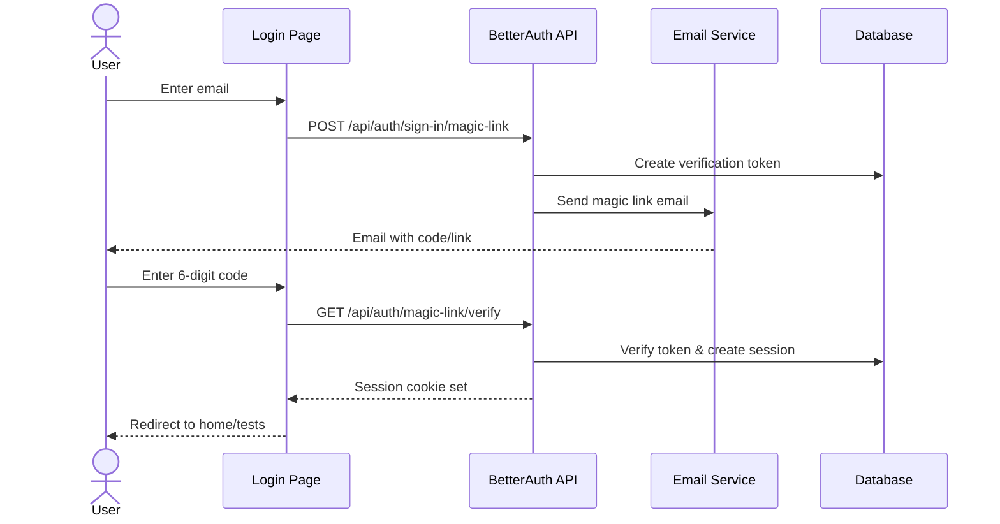

# Authentication

Persona[i] uses [BetterAuth](https://www.better-auth.com) for authentication with magic link-based login/signup.

## Overview

- **Authentication Method**: Magic link (passwordless)
- **Session Management**: Cookie-based sessions
- **User Identification**: Email address
- **Name Collection**: Prompted on first login/signup

## Authentication Flow

### Sign Up / Sign In

Both sign up and sign in use the same magic link flow:

1. **User enters email** on `/login` page
2. **Magic link sent** to user's email with 6-digit verification code
3. **User enters code** from email (or clicks magic link)
4. **Session created** and user redirected
5. **Name collection prompt** shown if user has no name set

### Magic Link Flow



## Login Page

The login page (`/login`) supports two modes:

- **Sign In** (default): `/login`
- **Sign Up**: `/login?mode=signup`

Both modes use the same flow, but display different text:
- Sign In: "Sign in to your account"
- Sign Up: "Create your account"

### Navigation

The login page includes the main navigation header:
- **Logo**: Navigates to `/` (landing) if not authenticated, `/tests` if authenticated
- **Navigation items**: Available for authenticated users
- **Account button**: Shows user name/email when authenticated

## Session Management

### Session Creation

Sessions are created automatically after successful magic link verification:
- Session stored in database (`session` table)
- Session cookie set with `HttpOnly` flag
- Session expires based on BetterAuth configuration

### Session Refresh

Sessions can be refreshed after user data updates (e.g., name changes):
- Frontend dispatches `session-refresh` custom event
- Components listen for event and re-fetch session
- Session data updated in UI

### Session Validation

All authenticated API endpoints validate sessions:
```typescript
const session = await auth.api.getSession({ headers: request.headers });
if (!session?.user) {
  return NextResponse.json({ error: "Unauthorized" }, { status: 401 });
}
```

## Name Collection

### Prompt Display

Users without a name set are prompted to enter their name:
- Prompt appears after successful login/signup
- Shown as a dialog/drawer component
- Cannot be dismissed until name is provided

### Name Update

Name can be updated via:
- **API**: `PATCH /api/auth/update-user`
- **Validation**: 2-50 characters, Unicode letters/numbers/spaces/hyphens/apostrophes
- **Session Refresh**: After update, session is refreshed to show new name

## Account Management

### Update User

**Endpoint**: `PATCH /api/auth/update-user`

**Request**:
```json
{
  "name": "John Doe"
}
```

**Response**:
```json
{
  "success": true,
  "message": "Name updated successfully"
}
```

**Errors**:
- `401 Unauthorized` - No valid session
- `400 Bad Request` - Invalid name format
- `404 Not Found` - User not found after update

### Delete Account

**Endpoint**: `DELETE /api/auth/delete-account`

**Request**:
```json
{
  "confirmed": true
}
```

**Response**:
```json
{
  "success": true,
  "message": "Account deleted successfully"
}
```

**Errors**:
- `401 Unauthorized` - No valid session
- `403 Forbidden` - Missing confirmation
- `500 Internal Server Error` - Deletion failed

**Note**: Account deletion:
- Deletes all user sessions
- Deletes user record (cascades to related tables)
- Requires explicit confirmation (`confirmed: true`)

## Security

### Session Security

- Sessions use `HttpOnly` cookies (not accessible via JavaScript)
- Session tokens are cryptographically secure
- Sessions expire based on configuration

### Magic Link Security

- Verification codes expire after 30 minutes
- Codes are single-use
- Rate limiting prevents abuse

### Account Deletion

- Requires explicit confirmation
- Audit logged with IP address
- All user data deleted (GDPR compliant)

## Environment Variables

Required for authentication:
- `BETTER_AUTH_SECRET` - Secret key for session encryption
- `BETTER_AUTH_URL` - Base URL for BetterAuth API
- `NEXT_PUBLIC_BETTER_AUTH_URL` - Public base URL for client
- `RESEND_API_KEY` - API key for email service (optional for development)
- `RESEND_FROM` - From email address for magic links

