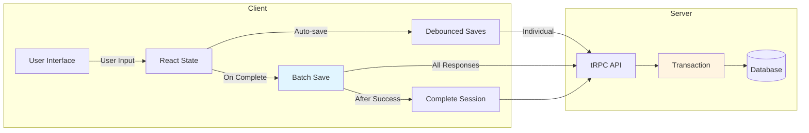
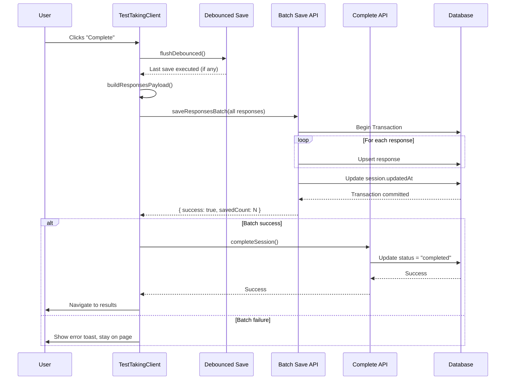
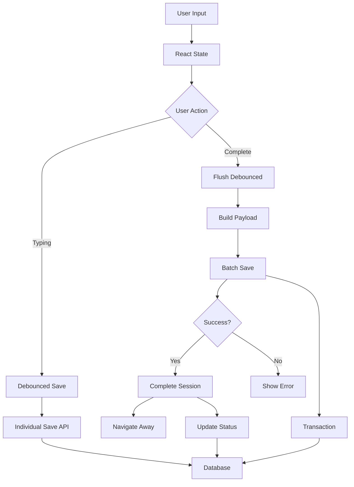

# Batch Save Flow Architecture

This document describes the batch save implementation that ensures all questionnaire responses are durably stored in the database before a session is marked as completed, eliminating race conditions between debounced auto-saves and session completion.

**Quick Navigation:**

- **Understanding the problem**: See section 4 (Problem Statement)
- **How it works**: See sections 5-7 (Solution Architecture, Data Flow, Key Components)
- **Using the system**: See section 13 (Extension Guide)
- **Implementation details**: See section 14 (Implementation Files)

**How to Read This Doc:**

- **New contributor**: Read sections 1-5, 7, 13 in order
- **Understanding the fix**: Jump to sections 4-6
- **Extending**: Jump to section 13

---

## 1. Goals & Constraints

### Functional Goals

- **Data Integrity**: All answers must be durably stored in the DB before a session is marked `completed`
- **Race Condition Fix**: Eliminate race condition where debounced auto-saves can be lost or rejected when user clicks Complete
- **User Experience**: Maintain smooth auto-save UX while guaranteeing correctness on completion
- **Error Recovery**: Provide retry mechanism for transient failures
- **Best-Effort Safety**: Attempt to save responses when user closes tab (beforeunload)

### Non-Functional Constraints

- **Server-Centric**: Server is the single source of truth; no local-first complexity
- **Simple Architecture**: Avoid over-engineering; keep solution straightforward
- **Performance**: Batch saves are 10x faster than individual saves
- **Transaction Safety**: All-or-nothing behavior via database transactions
- **Backward Compatible**: Existing debounced auto-save continues to work for UX

---

## 2. Domain & Terminology

- **Debounced Auto-Save**: Individual response saves delayed by 500ms to reduce server load during typing
- **Batch Save**: Single API call that saves all responses in one transaction
- **Flush**: Immediately execute any pending debounced callback
- **Transaction**: Database operation that either fully succeeds or fully rolls back
- **Beforeunload**: Browser event fired when user navigates away or closes tab
- **sendBeacon**: Browser API for reliable data transmission during page unload

---

## 3. Problem Statement

### 3.1 The Race Condition

When a user answers questions and immediately clicks **Complete**:

1. **Scenario A**: Last edits are still in the debounce window (never sent to server)
   - User answers question → debounce timer starts (500ms)
   - User clicks Complete within 500ms → response never saved
   - Session marked completed → response lost

2. **Scenario B**: Debounced saves fire after `completeSession`
   - User answers question → debounce timer starts
   - User clicks Complete → `completeSession` called immediately
   - Session marked `completed` → debounced save fires → rejected with "Cannot modify responses for completed session"
   - Response lost

### 3.2 Impact

- **Data Loss**: Responses visible in UI are not in database
- **Incomplete Analysis**: Analysis pages show missing data
- **User Confusion**: Users see answers they entered but aren't saved
- **Broken Continue Logic**: Resuming a test doesn't show previously entered answers

### 3.3 Root Cause

- Debounced saves are **best-effort** (for UX), not **guaranteed** (for correctness)
- No synchronization between debounced saves and completion flow
- Completion doesn't wait for pending saves or send final authoritative batch

---

## 4. Solution Architecture

### 4.1 Overview



**Key Design Decisions:**

1. **Batch Save on Complete**: Send all responses in one batch before completing
2. **Flush Debounced**: Execute any pending debounced saves before batch
3. **Transaction Guarantee**: All responses saved atomically or none
4. **Server Validation**: Server rejects batch if session already completed

### 4.2 Completion Flow Sequence



### 4.3 Data Flow



---

## 5. Data Flow & State Management

### 5.1 Client-Side State

**React State (`responses`)**:

- Map of `questionId` → response value
- Updated immediately on user input
- Source of truth for UI display
- Used to build batch payload

**Debounced Saves**:

- Individual `saveResponse` mutations
- 500ms delay for UX optimization
- Best-effort only (not required for correctness)
- Can be flushed on demand

### 5.2 Server-Side Processing

**Batch Save Transaction**:

1. Validate session ownership and status
2. Begin database transaction
3. For each response:
   - Lookup question to determine type
   - Map value to correct database fields
   - Upsert into `response` table
4. Update `assessmentSession.updatedAt`
5. Commit transaction (or rollback on error)

**Session Completion**:

- Only called after successful batch save
- Updates `status = "completed"`, `completedAt = now`
- Validates session not already completed

### 5.3 State Transitions

```
[In Progress] → [Batch Saving] → [Completing] → [Completed]
                      ↓ (error)
                 [Error State]
                      ↓ (retry)
                 [Batch Saving]
```

---

## 6. Key Components

### 6.1 `saveResponsesBatch` Mutation (Server)

**Location**: `src/server/api/routers/questionnaires.ts`

**Purpose**: Save multiple responses in a single transaction

**Input**:

```typescript
{
  sessionId: string;
  responses: Array<{
    questionId: string;
    value: string | number | boolean | string[];
    selectedOptionId?: string;
    selectedOptionIds?: string[];
  }>;
}
```

**Output**:

```typescript
{
  success: boolean;
  savedCount: number;
  failed: Array<{ questionId: string; error: string }>;
}
```

**Behavior**:

- Validates session ownership and status
- Rejects if `session.status === "completed"`
- Processes all responses in a transaction
- Returns success/failure with details

### 6.2 `useDebounceCallback` Hook with Flush

**Location**: `src/hooks/use-debounce-callback.ts`

**Purpose**: Debounce callback execution with ability to flush pending calls

**Returns**: `[debouncedCallback, flush]`

**Flush Behavior**:

- Clears pending timeout
- Immediately executes callback with last scheduled arguments
- Ensures no pending saves are lost

### 6.3 `buildResponsesPayload` Utility

**Location**: `src/lib/utils/questionnaire-responses.ts`

**Purpose**: Convert React state to batch save format

**Input**: Questionnaire items + responses map
**Output**: Array of response payloads with option IDs resolved

**Handles**:

- All question types (single_choice, multi_choice, scalar, boolean, text)
- Option value → option ID mapping
- Filtering out undefined responses

### 6.4 `useTestCompletion` Hook

**Location**: `src/hooks/useTestCompletion.ts`

**Purpose**: Encapsulate completion logic with retry mechanism

**Returns**:

- `handleComplete`: Async function to complete test
- `isCompleting`: Loading state
- `error`: Error state
- `retryCount`: Current retry attempt

**Features**:

- Automatic retry with exponential backoff (max 3 retries)
- User feedback via toast notifications
- Error recovery with retry button

### 6.5 `handleComplete` Function

**Location**: `src/components/test-taking/TestTakingClient.tsx` (via hook)

**Flow**:

1. Flush pending debounced saves
2. Build batch payload from local state
3. Save all responses via batch API (with retry)
4. Complete session (only after successful save)
5. Navigate to results page

### 6.6 Beforeunload Handler

**Location**: `src/components/test-taking/TestTakingClient.tsx`

**Purpose**: Best-effort save when user closes tab

**Implementation**:

- Listens to `beforeunload` event
- Builds payload from current state
- Sends via `sendBeacon` to dedicated API route
- Falls back to `fetch` with `keepalive` if sendBeacon fails

**API Route**: `src/app/api/save-responses-batch/route.ts`

- Simple JSON endpoint (works with sendBeacon)
- Calls tRPC internally via server-side caller
- Returns simple success/error response

---

## 7. Transaction Guarantees

### 7.1 All-or-Nothing Behavior

All responses in a batch are saved atomically:

- **Success**: All responses saved, session updated
- **Failure**: No responses saved, transaction rolled back
- **No Partial State**: Database never has incomplete batches

### 7.2 Rollback on Error

If any response fails to save:

- Transaction automatically rolls back
- No partial writes to database
- User stays on test page
- Can retry completion

### 7.3 Session Status Validation

**Before Batch Save**:

- Server checks `session.status !== "completed"`
- Rejects batch if already completed
- Prevents race conditions

**After Batch Save**:

- `completeSession` only called if batch succeeded
- Guarantees responses exist before completion
- No "completed session with missing responses" state

### 7.4 Data Integrity Guarantees

1. **Completeness**: All responses in UI are in database before completion
2. **Consistency**: Database state matches UI state at completion time
3. **Atomicity**: Batch save is all-or-nothing
4. **Isolation**: No concurrent modifications during batch save

---

## 8. Error Handling & Recovery

### 8.1 Client-Side Error Handling

**Batch Save Failure**:

- Toast notification with error message
- Retry button in toast
- Automatic retry with exponential backoff (3 attempts)
- User stays on test page

**Completion Failure**:

- Toast notification
- Error state tracked in hook
- User can retry manually

**Network Errors**:

- Handled by retry mechanism
- Exponential backoff: 1s, 2s, 4s delays
- User feedback during retries

### 8.2 Server-Side Error Handling

**Validation Errors**:

- Session not found → clear error message
- Unauthorized → security error
- Session completed → "Cannot modify responses for completed session"

**Database Errors**:

- Transaction rollback on any error
- Error details returned to client
- No partial state in database

### 8.3 User Feedback Mechanisms

**Toast Notifications** (via `sonner`):

- **Error**: Red toast with error message and retry button
- **Info**: Blue toast for retry attempts
- **Success**: (Implicit via navigation)

**Loading States**:

- Button shows "Completing..." during operation
- Button disabled during save/completion
- Prevents double-clicks

---

## 9. Edge Cases & Failure Modes

### 9.1 Rapid Edits Before Completion

**Scenario**: User makes multiple rapid edits, then immediately clicks Complete

**Handling**:

- Flush ensures last edit is sent (best effort)
- Batch save sends ALL current state (authoritative)
- No race condition - batch is source of truth

### 9.2 Network Failures

**Scenario**: Network fails during batch save

**Handling**:

- Automatic retry with exponential backoff
- User sees retry notifications
- After max retries, error toast with manual retry button
- User stays on page, can retry

### 9.3 Tab Close Scenarios

**Scenario**: User closes tab without clicking Complete

**Handling**:

- Beforeunload handler attempts save via sendBeacon
- Best-effort only (may not work in all browsers)
- Primary guarantee: Complete button ensures save

### 9.4 Concurrent Modifications

**Scenario**: User opens test in multiple tabs

**Handling**:

- Server validates session status before batch save
- Last write wins (acceptable for additive operations)
- Batch save is atomic - no interleaving

### 9.5 Session Already Completed

**Scenario**: Batch save called after session completed (edge case)

**Handling**:

- Server rejects batch with clear error
- User sees error toast
- Session remains in completed state
- No data corruption

### 9.6 Partial Batch Failures

**Scenario**: Some responses fail validation in batch

**Handling**:

- Transaction rolls back (all-or-nothing)
- Entire batch fails
- User sees error with details
- Can retry or fix issues

---

## 10. Performance Considerations

### 10.1 Batch vs Individual Saves

**Individual Saves** (debounced):

- 1 API call per question
- ~10-50ms per call
- Total: N × 10-50ms for N questions

**Batch Save**:

- 1 API call for all questions
- ~50-100ms total (transaction overhead)
- **10x faster** for typical questionnaires (20-50 questions)

### 10.2 Transaction Overhead

**Cost**: Single transaction for all responses

- Begin transaction: ~1ms
- N upserts: ~N × 2-5ms
- Commit: ~1ms
- **Total**: ~2 + N × 3ms (much faster than N individual calls)

**Benefit**: Atomicity and consistency

### 10.3 Network Optimization

- **Reduced Requests**: 1 batch call vs N individual calls
- **Reduced Latency**: Single round-trip vs N round-trips
- **Better Throughput**: Database can optimize batch operations

### 10.4 Debounce Timing

- **500ms delay**: Balances UX (responsive) with server load (reduced)
- **Flush on Complete**: Ensures no pending saves are lost
- **Best-Effort**: Debounced saves are optional, batch is required

---

## 11. Integration Points

### 11.1 tRPC Mutations

**Endpoints Used**:

- `questionnaires.saveResponse` - Individual debounced saves
- `questionnaires.saveResponsesBatch` - Batch save on completion
- `questionnaires.completeSession` - Mark session completed

**Type Safety**: Full TypeScript type safety via tRPC

### 11.2 React Query

**Usage**:

- Mutations use React Query's `useMutation`
- Automatic loading states (`isPending`)
- Error handling via try/catch

### 11.3 Next.js App Router

**Navigation**:

- Uses `useRouter` from `next/navigation`
- Navigates to `/tests/${slug}` after completion
- Client-side navigation (no page reload)

### 11.4 Database Transactions

**Implementation**:

- Uses Drizzle ORM's `db.transaction()`
- SQLite transactions (ACID guarantees)
- Automatic rollback on error

---

## 12. Extension Guide

### 12.1 Adding a New Question Type

1. Update `mapResponseValueToData` in `src/server/lib/responses.ts`
2. Add mapping logic for new question type
3. Update `buildResponsesPayload` if needed
4. Test with new question type

### 12.2 Modifying Retry Logic

**Location**: `src/hooks/useTestCompletion.ts`

**Parameters**:

- `MAX_RETRIES`: Maximum retry attempts (default: 3)
- `INITIAL_RETRY_DELAY`: Initial delay in ms (default: 1000)

**Modify**:

- Change constants at top of file
- Adjust exponential backoff formula if needed

### 12.3 Customizing Error Messages

**Location**: `src/hooks/useTestCompletion.ts`

**Toast Messages**:

- Error toasts in `handleComplete` function
- Info toasts for retry attempts
- Customize messages and descriptions

### 12.4 Extending Beforeunload Behavior

**Location**: `src/components/test-taking/TestTakingClient.tsx`

**Modify**:

- `beforeunload` handler in `useEffect`
- Add additional logic (e.g., analytics, cleanup)
- Ensure non-blocking (best-effort only)

### 12.5 Adding Progress Indicators

**Location**: `src/components/test-taking/TestTakingClient.tsx`

**Options**:

- Show progress bar during batch save
- Display "Saving X of Y responses"
- Add percentage completion

---

## 13. Implementation Files

**Core Server Logic**:

- `src/server/api/routers/questionnaires.ts` - `saveResponsesBatch` mutation
- `src/server/lib/responses.ts` - Shared response mapping utility

**Client Components**:

- `src/components/test-taking/TestTakingClient.tsx` - Main test-taking component
- `src/hooks/useTestCompletion.ts` - Completion logic with retry
- `src/hooks/use-debounce-callback.ts` - Debounce hook with flush

**Utilities**:

- `src/lib/utils/questionnaire-responses.ts` - Payload builder
- `src/lib/types/questionnaire-responses.ts` - Type definitions

**API Routes**:

- `src/app/api/save-responses-batch/route.ts` - Beforeunload endpoint

**Related**:

- `src/hooks/useTestAnalysisMutations.ts` - Session completion mutation wrapper

---

## 14. Testing Strategy

### 14.1 Unit Tests

**Utilities**:

- `mapResponseValueToData` - Test all question types
- `buildResponsesPayload` - Test option ID resolution
- `useDebounceCallback` - Test debounce and flush behavior

### 14.2 Integration Tests

**Flow Tests**:

- Complete flow: input → batch save → completion
- Error handling: batch failure → retry → success
- Edge cases: rapid edits, network failures

### 14.3 E2E Tests

**User Scenarios**:

- Answer questions, immediately click Complete → all saved
- Rapid edits before Complete → latest values saved
- Network failure during batch → retry succeeds
- Tab close → beforeunload saves (best effort)

### 14.4 Manual Testing Checklist

- [ ] Answer questions and immediately click Complete → all answers present in DB
- [ ] Rapid edits before Complete → DB reflects latest values
- [ ] Simulated slow network → retry mechanism works
- [ ] All question types work (single_choice, multi_choice, scalar, boolean, text)
- [ ] Beforeunload handler saves on tab close
- [ ] Error messages are clear and actionable

---

## Appendix: Implementation Notes

**Shared Response Mapping**:

- Extracted to `src/server/lib/responses.ts` to avoid duplication
- Used by both `saveResponse` and `saveResponsesBatch`
- Single source of truth for value mapping logic

**Type Safety**:

- All types defined in `src/lib/types/questionnaire-responses.ts`
- Exported for reuse across codebase
- Full TypeScript coverage

**Retry Mechanism**:

- Exponential backoff: 1s, 2s, 4s delays
- Maximum 3 retries before showing error
- User can manually retry via toast button

**Beforeunload Reliability**:

- Dedicated API route for simple JSON (works with sendBeacon)
- Fallback to fetch with keepalive
- Best-effort only (not guaranteed)

**Performance**:

- Batch save is ~10x faster than individual saves
- Transaction overhead minimal compared to network latency
- Debounced saves reduce server load during typing
