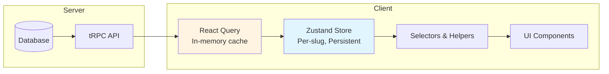
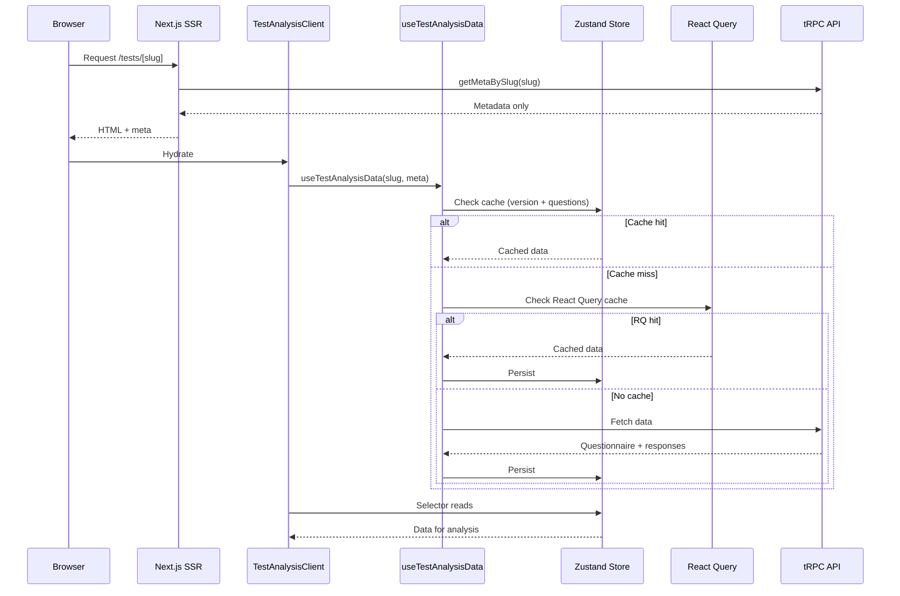
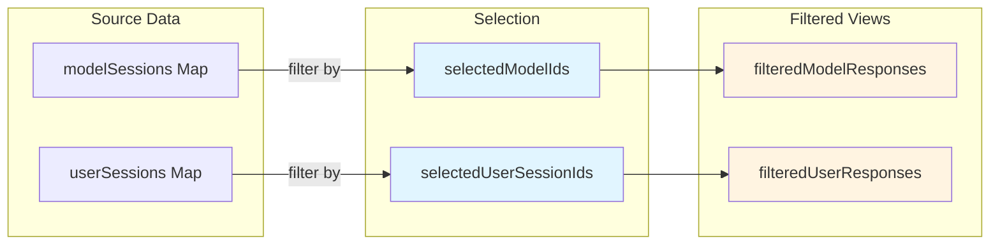
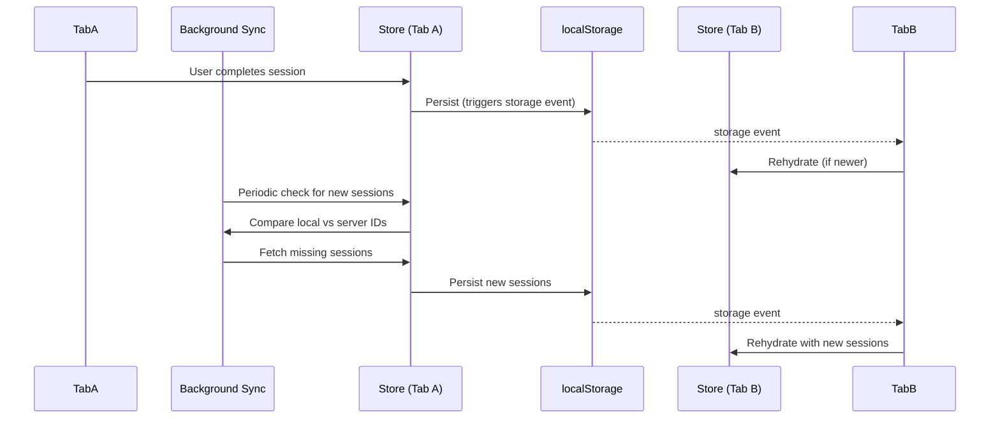

# Questionnaire Response Store Architecture

The store focuses on **data serving and filtering** - analysis computation is handled in page components using the store's data access helpers.

**Quick Navigation:**

- **Using the store**: See sections 8-9 (Operations, Selectors & Helpers)
- **Integrating with Next.js/tRPC**: See section 10
- **Understanding architecture**: See sections 3-5 (Data Model, Architecture Overview, Store Design)
- **Extending the store**: See section 12 (Extension Guide)

**How to Read This Doc:**

- **New contributor**: Read sections 1-5, 7, 9, 12 in order
- **Using the store**: Jump to sections 8-9
- **Extending**: Jump to section 12

---

## 1. Goals & Constraints

### Functional Goals

- Support **multiple questionnaires** concurrently (e.g. `disc`, `big-five`, `mbti`)
- **Instant switching** between questionnaires without refetching if cached
- **Instant data availability** on refresh using client-side persistence
- **Local data access** for analysis using only store data (no live API calls)
- **Filtered views** of responses for easy access in analysis components
- **Incremental updates**: New user sessions after test completion, background discovery across tabs
- **Data freshness** for user sessions with lightweight sync
- **SEO optimization** (SSR for questionnaire metadata) while minimizing server load

### Non-Functional Constraints

- **Persistence**: Full persistence of user and model analysis data on device (localStorage, design allows IndexedDB)
- **Multi-tab support**: Multiple tabs/windows stay in sync for same user and origin
- **Offline**: Page reload works from local cache; analysis UI uses cached data
- **Scale (per user)**: 15-20 models, 5-10 user sessions per questionnaire, 5-10 questionnaires cached
- **Architecture**: Zustand is primary source of truth; tRPC + React Query handle server state (no React Query persistence)

---

## 2. Domain & Terminology

- **Session**: Assessment session - single run of a questionnaire by a model (LLM) or user (human). Contains metadata (id, subject id, completedAt) and responses keyed by `questionId`
- **Questionnaire**: Logical test (e.g. DISC, Big Five) with one or more versions
- **Questionnaire version**: Immutable snapshot of questionnaire content and ordering
- **Model**: Shared across questionnaires (e.g. `gpt-5`, `claude-sonnet-4.5`), may have per-questionnaire configuration

We store **full responses** for sessions in the client cache to support rich local analysis and reduce server load.

---

## 3. Data Model & Invariants

### 3.1 Key Types & Structures

**Core Types:**

- `SessionResponses`: sessionId, subjectId, subjectType, displayName, responses (Map<questionId, ProcessedResponse>), completedAt
- `ProcessedResponse`: questionId, value (string|number|boolean|string[]|null), valueType
- `QuestionnaireMeta`: id, slug, title, version, versionId
- `ModelProfile`: id, displayName, subjectType, metadataJson
- `Question`: id, code, prompt, questionTypeCode, configJson, section, position, options
- `CacheMeta`: questionnaireId, version, versionId, timestamps

**Store Maps:**

- `questions`: Map<questionId, Question>
- `modelProfiles`: Map<modelId, ModelProfile>
- `modelSessions`: Map<sessionId, SessionResponses>
- `userSessions`: Map<sessionId, SessionResponses>

**Reference**: See `src/stores/useTestAnalysisStore.ts` for complete type definitions.

### 3.2 Invariants

The following invariants must always hold:

1. **Cache Consistency**: When cache is valid:
   - `cacheMeta.questionnaireId === meta.id`
   - `cacheMeta.versionId === meta.versionId`
   - `cacheMeta.version === meta.version`

2. **Session References**: Every session in `modelSessions` or `userSessions` references a known questionnaire via `meta.id`

3. **Response References**: Every response in `SessionResponses.responses` references a `questionId` that exists in the `questions` Map

4. **Selection Validity**:
   - `selectedModelIds` contains only IDs that exist as `subjectId` in `modelSessions` (when non-empty)
   - `selectedUserSessionIds` contains only IDs that exist as keys in `userSessions` (when non-empty)

5. **Derived Views**: `filteredModelResponses` and `filteredUserResponses` are derived from selection state and source Maps, automatically updated when selection changes
   - **Ordering**: Filtered arrays preserve Map iteration order (insertion order). When selecting "latest completed" user session, sorted by `completedAt` descending.

---

## 4. Architecture Overview

### 4.1 Layers



1. **Database / tRPC API**: Source of truth, exposed via typed tRPC endpoints
2. **React Query**: Server state fetching, deduplication, retries, in-memory caching (see Section 7.1 for cache order and role)
3. **Zustand Store**: Primary source of truth, per-slug instances, persistent to localStorage
4. **Selectors & Helpers**: Pure functions/hooks reading from Zustand, provide statistics/distributions
5. **UI Components**: Consume selectors + helpers, perform custom analysis computation

### 4.2 Data Flow



### 4.3 Per-Slug Store Topology

Each questionnaire slug has its own isolated Zustand store instance:

- **Storage key**: `test-analysis-${slug}` (e.g. `test-analysis-disc`)
- **Route determines store**: `/tests/disc` → `disc` store, `/tests/big-five` → `big-five` store
- **No global state**: URL slug is the source of truth, no `currentQuestionnaireId` needed
- **Benefits**: Simple mental model, natural isolation, easier migrations

### 4.4 Trade-offs & Limitations

**Per-Slug Duplication:**

- **Current Impact**: Models duplicated across stores (15-20 models × N questionnaires)
- **Why Acceptable**: ~3 questionnaires = ~45-60 model profiles, minimal memory impact (~50-100KB)
- **When to Revisit**: If scaling to 10+ questionnaires or if model profiles become large (>10KB each)
- **Refactoring Path**: Could introduce shared model store with per-slug references

**React Query Not Persisted:**

- **Rationale**: Zustand is source of truth; React Query is ephemeral optimization layer
- **Benefits**: Simpler mental model, no cache invalidation complexity, clear data flow
- **Trade-off**: React Query cache lost on refresh (acceptable since Zustand persists)

**Full Response Persistence:**

- **Benefits**: Rich local analysis, reduced server load, offline capability, instant UI updates
- **Costs**: localStorage size (~5-10KB per session), potential quota issues at scale
- **Mitigation**: Current scale acceptable (~50-100 sessions), LRU eviction not needed yet

**Known Limitations:**

- **localStorage-only**: Current implementation uses localStorage (design allows IndexedDB swap)
- **Last-write-wins**: Multi-tab uses timestamp comparison (acceptable for additive operations like sessions)
- **No Schema Versioning**: Store schema changes trigger full invalidation (no migration path)
- **Version Mismatch**: Any version change invalidates all cached data (by design - versions are immutable)

---

## 5. Store Design

### 5.1 State Shape

The store state (see Section 3.1 for types) is organized into:

**Core Data** (persisted): `meta`, `questions`, `modelProfiles`, `modelSessions`, `userSessions`, `cacheMeta`

**Selection State** (ephemeral): `selection` (selectedModelIds, selectedUserSessionIds) - controls filtered views, resets to defaults on refresh

**Derived Views** (computed): `filteredModelResponses`, `filteredUserResponses` - automatically updated from selection + source Maps

**Internal fields** (mutex, queues, metrics) are documented in the Implementation Notes appendix.

### 5.2 Selection & Filtering

The store uses a **selection-based filtering** pattern:

1. **Selection State**: User selects which models and user sessions to analyze
2. **Automatic Filtering**: Store computes filtered arrays based on selection
3. **Data Access**: Selectors and helpers read from filtered arrays

**How Filtering Works:**



**Example**: 15 model sessions → user selects 3 → `filteredModelResponses` contains only those 3. Selectors always read from filtered views, never source Maps directly.

**Smart Defaults** (see Section 5.3): All models + latest user session selected on refresh/initial load.

### 5.3 Design Principles

- **Per-Slug Isolation**: Each slug gets own store instance (see Section 4.3)
- **Automatic Filtering**: Filtered views update automatically when selection changes
- **Ephemeral Selection**: Not persisted; smart defaults (all models, latest session) applied after hydration only

---

## 6. Persistence & Storage

### 6.1 Storage Engine

- **Implementation**: `localStorage` via `zustand/middleware/persist` and `createJSONStorage`
- **Design**: Allows swapping to IndexedDB via custom storage adapter without changing store shape

### 6.2 Map/Set Serialization

Zustand/JSON don't natively persist `Map`/`Set`. Each per-slug store uses a **custom storage adapter** that:

- Serializes Maps/Sets as arrays before writing
- Reconstructs Maps/Sets on read
- Handles nested Maps in `SessionResponses.responses`
- Handles `QuotaExceededError` gracefully

**Partialize**: Only persists core data (`meta`, `questions`, `modelProfiles`, `modelSessions`, `userSessions`, `cacheMeta`). Selection and derived views are ephemeral.

### 6.3 Multi-Tab Synchronization

Listens to `storage` events, compares `lastAccessedAt` timestamps, rehydrates only if newer. Sessions are additive (no conflicts). See Section 7.4 for background sync interaction.

### 6.4 Schema Evolution

Version mismatch triggers full invalidation (no migration). Questionnaire versions are immutable; old cache incompatible with new version. No separate store schema versioning - relies on questionnaire version for validity. See Section 11.1 for version mismatch details.

---

## 7. Data Loading & Caching

### 7.1 Cache Check Order

For all resources (questionnaire, models, user data), check in this order:

1. **Zustand (per slug)** - primary persistent cache
2. **React Query in-memory cache** - from previous client loads
3. **API fetch** - only if neither has valid data

**Zustand is primary**: When valid cache exists (after hydration), UI is not blocked by React Query loading/errors. React Query runs in background for freshness.

**Offline/Warm-Cache**: On reload with valid Zustand cache, UI renders immediately (no loading spinner). React Query queries gated until after hydration.

### 7.2 Loading Flow

**SSR**: Metadata only (see Section 10.2). **Client**: Zustand → React Query → API for questionnaire, models, user data. Version mismatch invalidates all. Smart defaults (all models, latest session) applied after hydration only.

### 7.3 Incremental Updates

`useTestAnalysisMutations` wraps `completeSession` mutation. On success: fetches new session, adds to store (auto-selects), triggers background sync, invalidates React Query cache.

### 7.4 Background Sync

**Goal**: Only detect **new** user sessions, never fully refetch.

**Process:**

- `useUserSessionSync` hook periodically calls `getUserSessionIds`
- Compares with local `userSessions.keys()`
- Fetches missing sessions via `getSession` and adds to store
- Uses protection mechanisms to prevent concurrent syncs (see Implementation Notes)
- Stops when offline or user leaves page

**Multi-Tab Interaction:**



---

## 8. Store Operations

**Key Operations:**

- **Data Loading**: `loadQuestionnaireContent`, `loadModelData`, `loadUserData` - Load and persist data (do not modify selection)
- **Incremental Updates**: `addUserSession` - Add new session, auto-select, rebuild filtered views
- **Selection**: `setModelSelection`, `setUserSessionSelection` - Update filters, empty array = smart defaults
- **Sync**: `syncUserSessions` - Background sync with protection mechanisms
- **Invalidation**: `invalidateAll`, `invalidateUserSessions` - Clear cache on version mismatch

**API Reference**: See `src/stores/useTestAnalysisStore.ts` for complete action definitions.

---

## 9. Selectors & Data Access Helpers

### 9.1 Selectors

**Quick Reference:**

| Selector                      | Returns                       | Use Case                           |
| ----------------------------- | ----------------------------- | ---------------------------------- |
| `useQuestions()`              | `Question[]`                  | All questions (sorted by position) |
| `useQuestionsBySection()`     | `Array<{section, questions}>` | Questions organized by section     |
| `useQuestionsInSection(name)` | `Question[]`                  | Questions for specific section     |
| `useSections()`               | `string[]`                    | All section names                  |
| `useResponsesBySection()`     | `Array<{section, items}>`     | Responses organized by section     |
| `useModelResponses()`         | `SessionResponses[]`          | Filtered model responses           |
| `useHumanResponses()`         | `SessionResponses[]`          | Filtered user responses            |
| `useQuestionResponses(id)`    | `{models, humans}`            | All responses for a question       |
| `useSelectedModels()`         | `string[]`                    | Selected model IDs                 |
| `useSelectedUserSessions()`   | `string[]`                    | Selected session IDs               |
| `useModelProfiles()`          | `ModelProfile[]`              | All model profiles                 |

**All selectors automatically respect current model/session filter selections.**

**Principles:**

- Per-slug awareness: Read from per-slug store instance for current route
- Reference stability: Arrays memoized using `size` and sorted key string
- No network logic: Never call tRPC or React Query

### 9.2 Data Access Helpers

Helpers in `analysis-helpers.ts` provide statistics and data access for analysis computation:

- **Statistics**: `getQuestionStatistics`, `getResponseDistribution` - Mean, median, mode, histograms
- **Comparisons**: `getModelComparison`, `getUserVsModels`, `getModelSimilarity` - Compare responses across models/users
- **Aggregations**: `getAggregatedBySection`, `getQuestionResponseMatrix` - Group and structure data

**Principles:**

- Operate purely on store data (no network calls)
- Use filtered responses (respect current selection)
- Analysis computation (scoring, traits) done in page components, not store

---

## 10. React Query & Next.js Integration

### 10.1 React Query Role

tRPC hooks are used only in data loading (`useTestAnalysisData`), background sync (`useUserSessionSync`), and mutations (`useTestAnalysisMutations`). React Query is **not persisted**; its caches are per-session optimizations. See Section 7.1 for cache order and role details.

### 10.2 Next.js App Router

**SSR**: Fetch metadata only (`questionnaires.getMetaBySlug`), pass to client. **Client**: `TestAnalysisClient` initializes store, calls `useTestAnalysisData` which checks Zustand first. Ensures SEO (metadata in HTML), no loading spinner with cache, offline support.

---

## 11. Edge Cases & Failure Modes

### 11.1 Version Mismatch

Occurs when `cacheMeta.questionnaireId !== meta.id` OR `cacheMeta.versionId !== meta.versionId` OR `cacheMeta.version !== meta.version`. Action: `invalidateAll()` clears store, invalidates React Query caches, fresh load under new version.

### 11.2 Common Edge Cases

- **Cache Corruption**: Parse errors trigger clean reset (no crash)
- **localStorage Full**: Falls back to in-memory only (acceptable for ~3 questionnaires)
- **Multi-Tab Races**: Last-write-wins via timestamps; sessions are additive (no data loss)
- **Offline**: UI uses cached data; sync resumes on reconnect
- **API Failure (no cache)**: UI shows error state; React Query retries automatically; no fallback or partial data (requires server connection)
- **Partial Data**: Show available data, background sync continues
- **Privacy**: Data persisted indefinitely on device only; users can clear via browser localStorage

---

## 12. Extension Guide

### 12.1 Adding a New Selector

**Pattern:**

```typescript
export function useNewSelector() {
  const slug = useQuestionnaireSlug();
  const store = createTestAnalysisStore(slug);

  return useMemo(() => {
    const state = store.getState();
    // Read from filteredModelResponses or filteredUserResponses
    return state.filteredModelResponses.map(/* process */);
  }, [slug /* size/sorted keys for stability */]);
}
```

See `src/stores/selectors.ts` for complete patterns.

### 12.2 Adding a New Analysis Helper

Pure function taking `questionId`/`slug`, read store via `createTestAnalysisStore(slug)`, use `filteredModelResponses`/`filteredUserResponses`, return computed data. See `src/stores/analysis-helpers.ts` for patterns.

### 12.3 Adding a New Store Field

Update `TestAnalysisState` interface → add to `partialize` if persisting → update cache clearing if affects computed data → consider multi-tab sync → add to initialization. Don't persist derived fields; update version mismatch logic if affects cache validity.

### 12.4 Modifying Sync Behavior

Update `syncUserSessions` action → maintain protection mechanisms → test multi-tab → ensure storage events fire correctly. See `src/hooks/useUserSessionSync.ts` and `src/stores/useTestAnalysisStore.ts`.

---

## 13. Implementation Files

**Core**: `src/stores/useTestAnalysisStore.ts`
**Hooks**: `useTestAnalysisData.ts`, `useTestAnalysisMutations.ts`, `useUserSessionSync.ts`
**Data Access**: `selectors.ts`, `analysis-helpers.ts`
**Components**: `TestAnalysisClient.tsx`, `TestTakingClient.tsx`

**Related**: See [Batch Save Flow Architecture](./batch-save-flow.md) for details on how test completion ensures all responses are saved before session completion.

---

## Appendix: Implementation Notes

**Internal Fields** (not persisted): `_syncInProgress`, `_syncQueue`, `_syncErrors`, `_isOnline`, `_performanceMetrics`, `_computedCache` - implementation details for sync protection and performance tracking.

**Note**: `_computedCache` is currently experimental/unused and may be removed or changed in future. It is not part of the stable architectural contract.

**Sync Mechanisms**: Mutex (`_syncInProgress`), queue system, exponential backoff. See `src/stores/useTestAnalysisStore.ts` for details.
