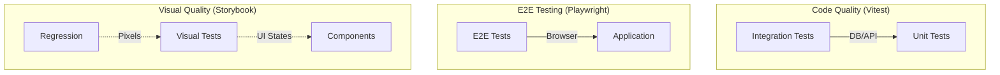

# Testing Guide

> **TL;DR**: This project uses a comprehensive testing strategy with **Vitest** for unit/integration tests, **Playwright** for E2E tests, and **Storybook** for visual development. Tests are co-located with code, and the infrastructure handles database isolation automatically.

## Overview

We employ a multi-layered testing strategy to ensure application reliability and UI consistency.



- **Unit Tests**: Pure logic and isolated component tests (fastest, uses Vitest).
- **Integration Tests**: Database operations and API endpoints (uses in-memory DB, uses Vitest).
- **E2E Tests**: Critical user journeys in a real browser (uses Playwright directly).
- **Visual Tests**: Component states, accessibility, and visual regression (uses Storybook).

## Quick Start

### Code Tests

```bash
bun run test:all          # Run all tests (Vitest + Playwright E2E + Storybook)
bun run test:unit         # Run unit tests only (Vitest)
bun run test:integration  # Run integration tests only (Vitest)
bun run test:e2e          # Run end-to-end tests only (Playwright)
bun run test:storybook    # Run automated interaction tests for stories (Storybook)
bun run test:watch        # Start watch mode for rapid development (Vitest)
```

### Visual Development

```bash
bun run storybook         # Start the Storybook development server
bun run test:storybook    # Run automated interaction tests for stories
```

## Test Infrastructure

### Environments

| Test Type       | Environment | Description                                                                    |
| :-------------- | :---------- | :----------------------------------------------------------------------------- |
| **Unit**        | `node`      | Runs in a server-like environment for pure logic and isolated component tests. |
| **Integration** | `node`      | Runs in a server-like environment for DB and API testing.                      |
| **E2E**         | `browser`   | Runs in actual browsers (Chromium, Firefox, WebKit) via Playwright.            |

### Database Isolation

The testing infrastructure is designed for **parallel execution** and **strict isolation**:

1.  **In-Memory SQLite**: By default, tests use an in-memory SQLite database (`file::memory:`).
2.  **Fresh State**: Each test context initializes a fresh database instance.
3.  **Auto-Migration**: The schema is automatically pushed to the in-memory database before tests run.

> [!IMPORTANT]
> We do **not** use `cache=shared` to ensure that parallel tests do not interfere with each other's database state. Each test gets its own isolated sandbox.

To debug with a persistent file-based database (forcing sequential execution), set the environment variable:
`TEST_DATABASE_URL="file:./debug.db" bun run test:integration`

## Directory Structure & Naming

We follow a **co-location** pattern where tests and stories live next to the source code they verify.

### Code Tests

Place tests in a `__tests__` directory adjacent to the file being tested.

```text
src/
└── components/
    └── ui/
        ├── Button.tsx
        └── __tests__/
            ├── Button.unit.test.ts      # Unit test
            ├── Button.integration.test.ts # Integration test
            └── Button.e2e.test.ts        # End-to-end test
```

**Naming Conventions:**

- `*.unit.test.ts`: Unit tests
- `*.integration.test.ts`: Integration tests
- `*.e2e.test.ts`: End-to-end tests

### Storybook Stories

Stories define the visual states of your components. They should be placed **in the same directory** as the component.

```text
src/
└── components/
    └── ui/
        ├── Button.tsx
        └── Button.stories.tsx       # Component stories
```

**Naming Convention:** `[Component].stories.tsx`

## Writing Tests

### 1. Unit Tests

Focus on individual functions, hooks, or components in isolation. Mock external dependencies.

```typescript
// src/utils/__tests__/cn.unit.test.ts
import { describe, expect, it } from "vitest";
import { cn } from "../cn";

describe("cn utility", () => {
  it("merges class names correctly", () => {
    expect(cn("p-4", "text-center")).toBe("p-4 text-center");
  });
});
```

### 2. Integration Tests

Verify that different parts of the system work together, typically involving the database.

```typescript
// src/server/api/routers/__tests__/post.integration.test.ts
import { describe, expect, it, beforeAll, afterAll, beforeEach } from "vitest";
import { getTestDb } from "@/test-utils/db";
import { setupTestDb, teardownTestDb } from "@/test-utils/db-setup";
import { posts } from "@/server/db/schema";
import { sql } from "drizzle-orm";

describe("Post Database Operations", () => {
  const db = getTestDb();

  beforeAll(async () => await setupTestDb());
  afterAll(async () => await teardownTestDb());
  beforeEach(async () => await db.run(sql`DELETE FROM ${posts}`));

  it("should create a post", async () => {
    const result = await db
      .insert(posts)
      .values({ name: "Test Post" })
      .returning();
    expect(result[0]?.name).toBe("Test Post");
  });
});
```

### 3. E2E Tests

Test complete user journeys in a real browser using **Playwright's test API directly**. The `test:e2e` command automatically starts an isolated Next.js dev server on port 5001.

```bash
bun run test:e2e          # Run E2E tests (starts server automatically)
bun run test:e2e:ui       # Run with Playwright UI mode
```

**Key Points:**

- E2E tests use **Playwright's test API** (`import { test, expect } from "@playwright/test"`), not Vitest
- Tests are configured via `playwright.config.ts`
- The webServer configuration automatically starts and manages the Next.js dev server
- All E2E tests run sequentially with a single worker, sharing the same webServer instance and database
- Test results are stored in `.test-results/` (gitignored)
- HTML reports are generated automatically - view by opening HTML files in `.test-results/` after test runs

#### E2E Test Example

```typescript
// src/app/__tests__/homepage.e2e.test.ts
import { test, expect } from "@playwright/test";

/**
 * Base URL for e2e tests.
 * Playwright automatically starts the server via webServer config.
 * Use relative paths or the baseURL from config.
 */

test.describe("Homepage E2E", () => {
  test("should load the homepage successfully", async ({ page }) => {
    // Use relative path - baseURL is configured in playwright.config.ts
    await page.goto("/");
    const title = await page.title();
    expect(title).toContain("Persona");
  });
});
```

### 4. Visual Stories

Define the different states of your UI components. These serve as both documentation and test cases.

```typescript
// src/components/ui/Button.stories.tsx
import type { Meta, StoryObj } from "@storybook/nextjs-vite";
import { Button } from "./Button";

const meta: Meta<typeof Button> = {
  title: "UI/Button",
  component: Button,
  tags: ["autodocs"], // Enables auto-generated documentation
};
export default meta;

type Story = StoryObj<typeof Button>;

export const Primary: Story = {
  args: {
    variant: "default",
    children: "Primary Action",
  },
};

export const Destructive: Story = {
  args: {
    variant: "destructive",
    children: "Delete Item",
  },
};
```

## Troubleshooting

| Problem                                  | Solution                                                                                                         |
| :--------------------------------------- | :--------------------------------------------------------------------------------------------------------------- |
| **"Table does not exist"**               | Ensure you are calling `setupTestDb()` in the `beforeAll` hook of your integration tests.                        |
| **Tests running sequentially**           | Check if `TEST_DATABASE_URL` is set in your environment. Unset it to return to parallel in-memory mode.          |
| **Story not appearing**                  | Verify the file ends in `.stories.tsx` and is located within `src/`. Check the browser console for build errors. |
| **E2E test fails - connection refused**  | The webServer config should start automatically. Check that port 5001 is available and not blocked               |
| **E2E test timeout**                     | Increase timeout in test, check server logs, ensure server started successfully                                  |
| **E2E test can't find element**          | Add `waitForLoadState("networkidle")` before assertions, use proper selectors                                    |
| **Port already in use (isolated tests)** | The script automatically finds available ports, but if issues persist, check for zombie processes                |

## Further Reading

- [Vitest Documentation](https://vitest.dev/)
- [Storybook Documentation](https://storybook.js.org/)
- [Testing Library](https://testing-library.com/)
- [Playwright](https://playwright.dev/)
