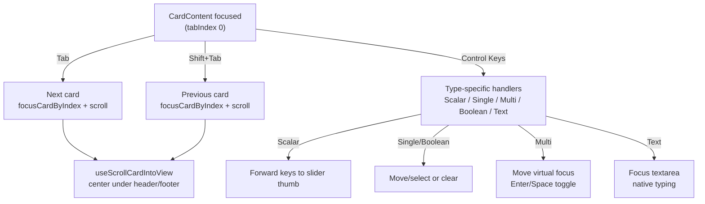

# Question Workflow Keyboard Navigation

How keyboard users move through the **question workflow** (test taking): cards rove as single tab stops, question types handle arrows differently, and the active card is kept between the sticky header and footer.

## Visual Overview

## Key Behaviors (TL;DR)

- One tab stop per card (`CardContent`); inner question wrappers are not tabbable.
- Tab/Shift+Tab move between cards; on the last card, Tab either advances to the next category’s first unanswered question (if complete) or falls through to footer actions.
- Arrow/Home/End/Page keys are forwarded to question-specific handlers; text questions push focus into the textarea when the card activates.
- Scroll keeps the active card centered between header/footer and skips tiny nudges to avoid jitter.

## Scope

- Applies only to the question workflow UI (not system-wide architecture).
- Audience: contributors changing keyboard nav, accessibility, or adding question types.
- Goals: dependable arrow-key semantics per type, centered scrolling when focus moves.

## Card-Level Navigation

- **Single tab stop**: `activeCardIndex` controls `tabIndex` 0/-1 on `CardContent`.
- **Tab/Shift+Tab**:
  - Between cards within a category.
  - On the last card: if the category is complete and not the final category, Tab jumps to the next category’s first unanswered card; otherwise Tab flows to footer actions.
  - Shift+Tab on the first card jumps to the prior category’s last card when available.
- **Clicks**: Sync `activeCardIndex` without stealing focus from slider thumbs; text areas get focus immediately when clicked.

## Per-Question Behavior

- **Scalar**: Arrow/Home/End/Page keys forward to the slider thumb when the thumb is not focused.
- **Single choice / Boolean**: Arrows move selection immediately; Enter/Space selects or clears the focused option.
- **Multi choice**: Arrows move a virtual focus index; Enter/Space toggles the focused option, respecting min/max constraints.
- **Text**: When a text card activates, focus moves into the textarea; Tab/Shift+Tab follow native textarea rules to exit.

## Focus Lifecycle

- On category change:
  - Virtual focus indices reset (`resetFocus`).
  - Refs rebuild to match the new items.
  - Active card targets the first unanswered question (fallback to index 0).
- `focusCardByIndex` sets `activeCardIndex`, focuses `CardContent` with `preventScroll`, and triggers scroll centering.
- Layout effects refocus the active card when `activeCardIndex` changes and on category switches once refs exist.

## Scroll Behavior

- `useScrollCardIntoView` centers the active card between the sticky header and footer, using `#main-scroll-container` when present (falls back to `window`).
- Small scroll deltas are skipped when already aligned to avoid jitter on tiny focus changes.

## Key Files

- `src/components/test-taking/TestTakingClient.tsx` — card-level roving focus, Tab/Shift+Tab routing between cards/categories, scroll calls.
- `src/hooks/useQuestionFocus.ts` — virtual focus indices for single- and multi-choice so arrows can highlight without tabbing into options.
- Type-specific handlers:
  - `questions/ScalarQuestion.tsx`
  - `questions/BooleanQuestion.tsx`
  - `questions/SingleChoiceQuestion.tsx`
  - `questions/MultiChoiceQuestion.tsx`
  - `questions/TextQuestion.tsx`

## Extending & Debugging

- Adding a question type: keep inner controls out of the tab order, add `handle<Type>KeyboardNavigation`, and wire it into `handleCardContentKeyDown`.
- Changing card wrappers/templates: keep `[data-question-card-root]` or update `findQuestionCardElement` so card-level focus can find the interactive root.
- Adjust header/footer sizes: update offsets in `useScrollCardIntoView` to keep centering accurate.
